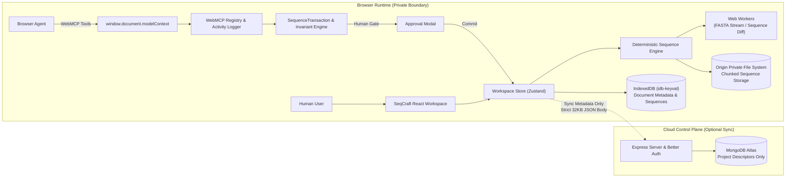

# SeqCraft

SeqCraft is a browser-native DNA engineering workbench with deterministic sequence analysis and a structured WebMCP interface that lets browser agents inspect, analyze, navigate, and propose changes to the same molecular model a human is working on.

[](test)
[](test)
[](tsconfig.json)
[](src/webmcp/registry.ts)
[](https://seqcraft.onrender.com)
[](https://seqcraft.up.railway.app/api/health)
[](LICENSE)

---

## Capabilities at a Glance

* **Linear and 3D Plasmid Visualization**: Monospace `ch`-metric virtualized sequence rendering alongside a Three.js / WebGL 3D annular ribbon map with lane collision packing, directional feature arrows, and drag-selection.
* **Enzymatic Analysis & Digestion**: IUPAC-aware restriction site recognition for linear and circular topologies, multi-enzyme digest fragment profiling, sticky/blunt overhang classification, and exact double-strand cut geometry for forward/reverse restriction cloning.
* **Type IIS Assembly & Domestication**: Directional Golden Gate assembly simulation (BsaI, BsmBI, BbsI, PaqCI, SapI) with circular junction segment wrapping, cohesive overhang validation, and synonymous codon substitutions verified across full flanking regions.
* **Thermodynamics, Primers & PCR**: Nearest-neighbor melting temperature ($T_m$) calculations, mismatch and ambiguity detection, linear/circular amplicon simulation, and overlap-extension PCR support.
* **Multi-Nuclease CRISPR & MMEJ Forecasting**: Guide scanning for SpCas9, SaCas9, Cas12a, and Cas12e with per-nuclease PAM and spacer length rules, circular origin wrapping, GC content balancing, poly-T transcription termination checks, and microhomology-mediated end joining (MMEJ) repair deletion forecasting.
* **Laboratory Automation & Diagnostic Screening**: Direct Opentrons Python protocol compilation (OT-2 / Flex API v2.15) with strict deck collision prevention and dynamic tip allocations; offline heuristic biosecurity screening against 18 curated regulated agent signatures with circular origin bridging.
* **Bio-CAD Interoperability**: Full export to NCBI GenBank flat-file format (`LOCUS`, `FEATURES`, `join()`, `complement()`, and grouped `ORIGIN` lines) for seamless import into Benchling and SnapGene, alongside FASTA and native `.seqcraft` JSON.
* **In-Place Mutation History & Undo/Redo**: 50-step snapshot sequence transaction stack with global keyboard shortcuts (`Ctrl/Cmd+Z`, `Ctrl/Cmd+Y`, `Ctrl/Cmd+Shift+Z`) and programmatic WebMCP tools (`seqcraft_undo`, `seqcraft_redo`).
* **Local-First Privacy Architecture**: All raw sequence bytes, annotations, and derived constructs remain strictly inside the browser runtime (IndexedDB and OPFS). The cloud control plane receives only sequence-free metadata descriptors.
* **Complete WebMCP Semantic Actuation Surface**: 50 structured tools registered via `window.document.modelContext` across 12 biological modules with explicit mutation risk classification (`EffectClass`) and revision-locked pre-commit sequence transactions.

---

## Why SeqCraft Exists

Traditional molecular biology software interacts almost exclusively through desktop GUIs. While large language models can discuss genetics and design workflows, asking browser agents to operate graphical interfaces through multimodal screenshots or raw string pasting introduces serious failure modes: coordinate offsets drift, reading frames slip, and non-deterministic visual inference replaces mathematical precision.

SeqCraft addresses this by exposing its biological analysis engine directly to browser agents through **WebMCP** (`window.document.modelContext`).

Instead of clicking pixels or parsing screen text, an agent calls typed, developer-authored biological functions. Because human users and browser agents operate against the identical in-memory document model, agents can highlight visual regions, inspect enzyme cut sites, run assembly simulations, and stage sequence modifications directly in the human interface.

---

## WebMCP Integration

SeqCraft exposes 50 structured tools through the emerging WebMCP browser standard across 12 biological actuation families. Tools declare typed input schemas, execution constraints, and behavioral annotations (`readOnlyHint`, `untrustedContentHint`).

### Example Agent Trajectory

Consider a human delegating a construct preparation task:

```text
Human:
"Check whether this construct can be assembled with BsaI Golden Gate.
If an internal site blocks assembly, find a protein-preserving repair.
Do not modify the sequence without my approval."
```

The agent executes the following tool trajectory against the active document:

```text
Agent → SeqCraft (WebMCP)
  1. seqcraft_get_active_document
  2. seqcraft_analyze_restriction_sites   → detects 1 internal BsaI site
  3. seqcraft_simulate_golden_gate        → blocked: internal cut generates illegitimate junction
  4. seqcraft_focus_region                → navigates human viewport to internal site [482, 487]
  5. seqcraft_domesticate_sequence        → calculates synonymous GGTCTC → GGCCTC substitution
  6. seqcraft_edit_sequence               → stages SequenceTransaction (awaiting human approval)

Human (SeqCraft UI)
  Reviews staged transaction: CDS translation unchanged, coordinate delta 0 bp, internal site eliminated.
  Clicks "Apply" in approval interface.

Agent → SeqCraft (WebMCP)
  7. seqcraft_analyze_restriction_sites   → confirms 0 BsaI sites remain
  8. seqcraft_simulate_golden_gate        → assembly successful; junctions validated
  9. seqcraft_generate_opentrons_protocol → compiles Python liquid-handling script
```

---

## Verified Agent Run

Every WebMCP call executed in SeqCraft is tracked in an in-memory provenance timeline managed by `useActivityStore` and displayed in the **Agent Run** panel.

```text
✓  get active document            User Plasmid (4,812 bp)
✓  analyze restriction sites      1 site detected (BsaI)
✕  simulate golden gate           assembly blocked: internal cut
✓  focus region                   bases 482–487 highlighted
✓  domesticate sequence           found synonymous mutation (Gly-Leu)
◉  edit sequence                  staged transaction · awaiting human approval
✓  human approve sequence edit    applied · revision 1 → 2
✓  analyze restriction sites      0 sites (BsaI abolished)
✓  simulate golden gate           assembly valid (circular product)
✓  generate opentrons protocol    Python script compiled (OT-2)
```

### Provenance Tracking

For every tool execution, SeqCraft records:
* Call identifier, timestamp, and wall-clock duration in milliseconds.
* Tool name, categorization (`read`, `navigation`, `mutation`, `export`), and execution status (`success`, `error`, `awaiting_approval`, `rejected`).
* Sanitized arguments (nucleotide strings longer than 80 characters are truncated in logs to avoid memory bloat).
* Target `documentId`, `documentRevisionBefore`, and SHA-256 `sequenceHashBefore`.
* Post-execution `documentRevisionAfter` and SHA-256 `sequenceHashAfter` when modifications are applied.

### Pre-Commit Sequence Transactions

When an agent invokes a sequence modification tool (`seqcraft_edit_sequence`), the edit is **not** committed to the sequence buffer immediately. Instead, SeqCraft stages a `SequenceTransaction` object containing:

1. **Base Revision & Hash**: The document version number and SHA-256 hash at the moment of analysis.
2. **Operation Details**: The coordinate range (`start0`, `end0Exclusive`), action type (`insert`, `delete`, `replace`, `reverse_complement`), and replacement sequence.
3. **Biological Invariant Verification**: Before presentation to the user, SeqCraft executes automated checks against the proposed edit:
   * **Sequence Length Delta**: Verifies whether overall nucleotide count changes or coordinates remain stable.
   * **CDS Translation Check**: Translates affected coding sequences before and after mutation using `nucleotide-sequence` to verify whether the alteration is synonymous.
   * **Codon and Amino Acid Context**: Identifies the exact codon substitution (e.g., `GGT` → `GGC`) and amino acid effect (e.g., `Gly` → `Gly`).
   * **Enzyme Site Verification**: Confirms that the targeted restriction enzyme site is abolished without introducing secondary recognition sites.

### Revision-Locked Safety

If a human user edits the construct or switches documents while a transaction is pending, the transaction detects the discrepancy:

```
activeDoc.version ≠ tx.baseRevision  ∨  SHA256(activeDoc.raw) ≠ tx.baseSequenceHash
```

The transaction is flagged as `stale`, preventing execution:

```text
Stale transaction: Sequence changed after this proposal was analysed. Re-analysis required.
```

---

## WebMCP Tool Reference (50 Tools)

SeqCraft registers 50 tools via `window.document.modelContext.registerTool` organized across 12 domain modules:

### 1. Context & Capabilities
| Tool Name | EffectClass | Description |
| :--- | :--- | :--- |
| `seqcraft_get_workspace_context` | `read` | Preferred bootstrap tool returning active molecule summary, selection state, feature details, pending transaction, and tool catalog count. |
| `seqcraft_get_capabilities` | `read` | Discovers supported workflows, coordinate contracts, privacy rules, and recommended agent call sequences. |
| `seqcraft_get_selected_context` | `read` | Returns active selection coordinates, exact local sequence slice, overlapping features, and active view. |
| `seqcraft_get_document_revision` | `read` | Returns document ID, name, revision number, and canonical SHA-256 sequence hash. |
| `seqcraft_get_transaction_status` | `read` | Live transaction provenance and status (pending, approved, rejected, applied, stale). |

### 2. Workspace Navigation & Selection
| Tool Name | EffectClass | Description |
| :--- | :--- | :--- |
| `seqcraft_focus_region` | `navigation` | Highlights and scrolls viewport to a 1-based inclusive nucleotide range `[start1, end1]`. |
| `seqcraft_select_range` | `navigation` | Sets the workspace sequence selection interval. |
| `seqcraft_clear_selection` | `navigation` | Clears the current sequence selection. |
| `seqcraft_set_active_view` | `navigation` | Switches active editor view mode (`'map'`, `'sequence'`, `'topology'`). |
| `seqcraft_show_feature` | `navigation` | Centers viewport and selects an annotated sequence feature by identifier or name. |
| `seqcraft_show_restriction_site` | `navigation` | Navigates the linear and 3D map views to a specific restriction enzyme recognition site. |

### 3. Document Lifecycle & Metadata
| Tool Name | EffectClass | Description |
| :--- | :--- | :--- |
| `seqcraft_list_documents` | `read` | Lists metadata for all sequence documents in the active workspace. |
| `seqcraft_get_active_document` | `read` | Returns active construct metadata, topology, length, revision, and feature summaries. |
| `seqcraft_set_active_document` | `workspace_ephemeral` | Switches the active document in the workspace. |
| `seqcraft_create_document` | `document_destructive` | Creates a new sequence document in the workspace from raw sequence text. |
| `seqcraft_delete_document` | `document_destructive` | Closes and deletes a document from the workspace. |
| `seqcraft_duplicate_document` | `document_destructive` | Creates a deep copy of an existing document. |
| `seqcraft_update_document_metadata` | `document_metadata` | Updates document name, topology (linear/circular), or alphabet. |
| `seqcraft_create_document_from_region` | `document_destructive` | Extracts a sub-region into a new independent sequence document. |
| `seqcraft_copy_region_between_documents` | `sequence_mutation` | Stages insertion of a sequence segment from one document into another. |

### 4. Features & Annotations
| Tool Name | EffectClass | Description |
| :--- | :--- | :--- |
| `seqcraft_list_features` | `read` | Returns all annotated features on the active construct. |
| `seqcraft_select_feature` | `navigation` | Selects a feature by ID in the workspace store. |
| `seqcraft_mutate_feature` | `annotation_mutation` | Creates, updates, or deletes feature annotations on a document. |
| `seqcraft_detect_known_features` | `read` | Scans construct against curated plasmid elements (promoters, origins, selection markers). |
| `seqcraft_propose_annotation` | `annotation_mutation` | Applies a detected known feature match to the document annotation table. |

### 5. Primers & PCR
| Tool Name | EffectClass | Description |
| :--- | :--- | :--- |
| `seqcraft_list_primers` | `read` | Returns all custom oligonucleotides and primers configured for the target molecule. |
| `seqcraft_mutate_primer` | `annotation_mutation` | Creates, updates, or removes primers associated with the construct. |
| `seqcraft_analyze_primer` | `read` | Computes primer length, GC percentage, melting temperature (Tm), and binding sites across the construct. |
| `seqcraft_simulate_pcr` | `read` | Simulates linear or circular PCR amplification between forward and reverse primers. |

### 6. Enzymatic Digestion & Cloning
| Tool Name | EffectClass | Description |
| :--- | :--- | :--- |
| `seqcraft_analyze_restriction_sites` | `read` | Scans linear or circular sequences for restriction enzyme cut positions, overhang types, and cut frequencies. |
| `seqcraft_simulate_digest` | `read` | Cleaves construct with one or more enzymes, predicting sorted fragment sizes and terminal overhang compatibilities. |
| `seqcraft_simulate_golden_gate` | `read` | Simulates multi-part Type IIS assembly (BsaI, BsmBI, BbsI, PaqCI, SapI) with cohesive overhang verification. |
| `seqcraft_domesticate_sequence` | `read` | Proposes silent synonymous mutations to eliminate internal restriction sites without altering protein translation. |
| `seqcraft_stage_domestication_candidate` | `sequence_mutation` | Stages a specific domestication candidate mutation as a revision-locked transaction. |
| `seqcraft_prepare_restriction_clone` | `workspace_ephemeral` | Stages a directional restriction cloning construct proposal for human review. |

### 7. Sequence Mutation & Revision Staging
| Tool Name | EffectClass | Description |
| :--- | :--- | :--- |
| `seqcraft_edit_sequence` | `sequence_mutation` | Stages an in-place insertion, deletion, or replacement transaction for human review. |
| `seqcraft_reverse_complement_region` | `sequence_mutation` | Stages an in-place reverse complement of a nucleotide region `[start1, end1]`. |
| `seqcraft_rotate_origin` | `sequence_mutation` | Stages setting a new circular origin (position 1) on a circular plasmid. |

### 8. History & Undo/Redo
| Tool Name | EffectClass | Description |
| :--- | :--- | :--- |
| `seqcraft_undo` | `workspace_ephemeral` | Reverts the last sequence or metadata mutation on the active document. |
| `seqcraft_redo` | `workspace_ephemeral` | Re-applies the last undone mutation on the active document. |
| `seqcraft_get_history` | `read` | Inspects the undo/redo snapshot stack and history event log for the document. |
| `seqcraft_restore_revision` | `sequence_mutation` | Stages restoring the molecule to a previous snapshot state from the history stack. |

### 9. Genomics, Analysis & Compliance
| Tool Name | EffectClass | Description |
| :--- | :--- | :--- |
| `seqcraft_compare_documents` | `read` | Performs circular-invariant, reverse-complement-aware diffing between reference and query documents. |
| `seqcraft_find_orfs` | `read` | Detects open reading frames across all 6 translation frames above a minimum codon threshold. |
| `seqcraft_find_crispr_targets` | `read` | Identifies guide RNA target sites for SpCas9, SaCas9, Cas12a, and Cas12e; calculates GC balance scores and forecasts MMEJ repair deletion profiles. |
| `seqcraft_screen_biosecurity` | `read` | Executes client-side diagnostic comparison against curated k-mer sequences of regulated pathogens and toxins. |

### 10. Import, Export, Automation & Batch
| Tool Name | EffectClass | Description |
| :--- | :--- | :--- |
| `seqcraft_import_sequence_text` | `document_destructive` | Parses and imports FASTA, GenBank, or raw sequence text into the workspace. |
| `seqcraft_search_sequence_database` | `read` | Searches public biological sequence databases (NCBI GenBank/RefSeq, ENA, Addgene) for accessions, constructs, or genes. |
| `seqcraft_import_from_database` | `workspace_ephemeral` | Fetches and imports authoritative biological records by accession ID (e.g. J01749.1, NC_001416.1, OQ870305.1). |
| `seqcraft_export_document` | `export` | Serializes and exports construct to NCBI GenBank (.gb), FASTA (.fasta), or `.seqcraft` JSON. |
| `seqcraft_generate_opentrons_protocol` | `export` | Compiles Python protocol scripts (API v2.15) for Opentrons OT-2 and Flex liquid handlers. |
| `seqcraft_execute_actions` | `sequence_mutation` | Executes an atomic batch list of sequence and annotation actions. |

---

## Scientific Capabilities

| Area | Capabilities | Implementation |
| :--- | :--- | :--- |
| **Coordinate System** | 0-based half-open `[start, end)` internally; 1-based inclusive `[start, end]` in UI & WebMCP. Origin-spanning circular features partitioned into canonical `[start, len)` and `[0, end)` segments. | `src/domain/document.ts`<br/>`src/scientific/canonical-sequence.ts` |
| **Restriction Enzymes** | IUPAC nucleotide pattern matching across standard NEB/Thermo libraries; categorizes 5′ overhangs, 3′ overhangs, and blunt termini; linear and circular cut mapping. | `src/scientific/restriction-analysis.ts`<br/>`src/data/restriction-enzymes.ts` |
| **In Vitro Digestion** | Multi-cut cleaving, fragment sizing, sticky-end orientation, and terminal overhang matching. | `src/scientific/digest.ts`<br/>`src/scientific/digest-ends.ts` |
| **PCR & Primers** | SantaLucia nearest-neighbor thermodynamic Tm calculation, GC content evaluation, mismatch tolerance, multi-binding ambiguity detection, linear and circular amplicon prediction. | `src/scientific/pcr.ts`<br/>`src/scientific/primer-binding.ts`<br/>`src/scientific/primer-properties.ts` |
| **Translation & ORFs** | Six-frame translation (standard genetic code 1), circular wrap-around ORF detection, customizable minimal codon cutoffs. Powered by `nucleotide-sequence`. | `src/scientific/orf.ts`<br/>`src/scientific/protein-consequences.ts` |
| **Golden Gate Assembly** | Multi-fragment Type IIS assembly simulation (BsaI, BsmBI, BbsI, PaqCI, SapI) with 4 nt overhang fidelity verification. Synonymous codon domestication preserving amino acid sequences. | `src/scientific/golden-gate.ts`<br/>`src/scientific/transaction-invariants.ts` |
| **CRISPR & MMEJ** | Multi-nuclease guide scanning (SpCas9 NGG, SaCas9 NNGRRT, Cas12a TTTV, Cas12e TTCN) with per-nuclease spacer lengths, GC balance scoring (40–60% optimal), poly-T run penalties (T ≥ 4), and microhomology alignment forecasting deletion profiles. | `src/domain/crispr.ts`<br/>`src/scientific/crispr.ts` |
| **Robotics Automation** | Executable Python protocol generation for Opentrons OT-2 and Flex robots (API v2.15), automated 10% dead-volume overage calculations, 24-tube rack layouts, and thermocycler ramp/elongation timing. | `src/scientific/opentrons-compiler.ts` |
| **Biosecurity Pre-Screen** | Offline diagnostic comparison against 18 curated pathogenic and toxin k-mer signatures across four regulatory tiers (Tier 1 Select Agent, HHS/USDA Select Agent, Controlled Toxin, Dual-Use Pathogen). Generates structured JSON diagnostic reports with scope disclosures. | `src/scientific/biosecurity.ts` |
| **Construct Comparison** | Alignment engine invariant to circular origin shifts and reverse-complement orientation. Identifies insertions, deletions, substitutions, and coding consequence impacts. | `src/scientific/biological-sequence-diff.ts`<br/>`src/workers/sequence-diff.worker.ts` |

Detailed mathematical formulations, thermodynamic parameters, and coordinate contracts are documented in [docs/FEATURES.md](docs/FEATURES.md) and the in-app Reference Manual (`/docs`).

---

## Browser-Native Architecture

SeqCraft operates on a local-first model where biological sequence computations happen directly within the client browser.



### Architectural Boundaries

* **Unified Domain Core**: The user interface and WebMCP tools call the identical scientific functions and Zustand store actions. An agent cannot perform actions that the underlying domain engine does not support.
* **Web Worker Concurrency**: Computationally intensive tasks run on dedicated background threads:
  * `fasta-importer.worker.ts`: Streams large FASTA files directly into OPFS without blocking the UI thread.
  * `sequence-diff.worker.ts`: Computes Myers diffs and circular alignments off the main thread.
* **Local Sequence Storage**: Sequence bytes and feature tables are persisted exclusively inside the browser:
  * In-memory documents: Stored in IndexedDB via `idb-keyval`.
  * Large chunked documents: Streamed and stored in the Origin Private File System (OPFS).
* **Strict Network Privacy Boundary**: Biological sequence strings, imported file bodies, derived constructs, digests, and trace files **never** leave the browser. The Express backend and MongoDB database handle user authentication (Better Auth) and project metadata descriptors only:
  ```typescript
  // Allowed server document descriptor (server/privacy/project-metadata.ts)
  {
    id: string;
    name: string;
    length: number;
    alphabet: 'dna' | 'rna' | 'mixed' | 'protein' | 'unknown';
    topology: 'linear' | 'circular';
    localStorageKey: string; // opaque client-side reference
  }
  ```
  This constraint is strictly validated by Zod schemas and enforced by a 32 KB request body limit on all API routes. There is no document or sequence upload endpoint.

---

## Sequence Transactions and Safety

To prevent silent biological degradation, mutating operations require human authorization.

```text
PROPOSED SEQUENCE TRANSACTION
Position:           1,482
Change:             A → C
DNA:                GGTCTC → GGCCTC
Protein:            Gly-Leu → Gly-Leu (✓ synonymous, translation unchanged)
Length:             4,812 bp → 4,812 bp (delta: 0 bp)
Coordinates:        ✓ feature coordinates stable
Enzyme sites:       BsaI: 1 → 0 (abolished)
Base revision:      1 (SHA-256: e3b0c44298fc...)
Status:             awaiting human approval
```

### Safety Guarantees

* **Deterministic Invariant Checks**: Every staged edit evaluates protein coding consequences across overlapping CDS features before the human review dialog opens.
* **Revision and Hash Locking**: Staged transactions capture the document version number and sequence SHA-256 digest at creation time. If the underlying sequence changes before approval, the transaction is immediately invalidated as stale.
* **Coordinate Stability Verification**: Insertions and deletions shift downstream feature coordinates using validated interval arithmetic (`src/scientific/sequence-editing.ts`), while substitutions preserve exact feature coordinate parity.

---

## Quick Start

### Hosted Deployments

* **Frontend Application**: [https://seqcraft.onrender.com](https://seqcraft.onrender.com)
* **Backend API**: [https://seqcraft.up.railway.app](https://seqcraft.up.railway.app) (Health check: [`/api/health`](https://seqcraft.up.railway.app/api/health))

### Prerequisites

* Node.js 20.0.0 or higher
* npm 10.0.0 or higher

### Installation & Local Run

```bash
# Clone the repository
git clone https://github.com/sea-deep/seqcraft.git
cd seqcraft

# Install dependencies
npm install

# Run frontend (port 5173) and backend API (port 8787) concurrently
npm run dev:all
```

Open `http://localhost:5173` in your browser.

Without backend configuration or credentials, SeqCraft runs in **guest mode**, using local browser storage (IndexedDB and OPFS) with full scientific and WebMCP functionality.

---

## Using WebMCP

SeqCraft registers tools via `window.document.modelContext`.

### Browser Environment

* **Supported Browsers**: WebMCP is currently available in experimental Chromium builds supporting the Model Context API, or in any modern browser via the included `@mcp-b/webmcp-polyfill` (initialized automatically at application bootstrap).
* **Security Headers**: In production deployments, reverse proxies must serve:
  ```http
  Origin-Agent-Cluster: ?1
  Permissions-Policy: tools=(self)
  ```

### Inspecting WebMCP via DevTools

```javascript
// Check WebMCP runtime registration status
await window.__SEQCRAFT_WEBMCP__.status();
// Returns: { available: true, registered: true, secureContext: true, modelContextAvailable: true }

// List all 50 registered SeqCraft tools and schemas
await window.__SEQCRAFT_WEBMCP__.listTools();

// Or access document.modelContext directly
await document.modelContext.getTools();
```

---

## Development

```bash
# Run unit and integration tests (64 test files, 389 tests)
npm test

# Build client and server bundles
npm run build

# Build client bundle only
npm run build:client

# Typecheck server codebase
npm run typecheck:api
```

---

## Project Structure

```text
seqcraft/
├── src/
│   ├── domain/           # Biological and application domain types
│   │   ├── crispr.ts             # Multi-nuclease registry (SpCas9, SaCas9, Cas12a, Cas12e)
│   │   └── feature-ontology.ts  # 42-type feature ontology across 7 categories
│   ├── scientific/       # Deterministic biological analysis modules
│   │   ├── restriction-analysis.ts   # IUPAC restriction recognition
│   │   ├── golden-gate.ts            # Type IIS assembly & domestication
│   │   ├── pcr.ts                    # Thermodynamic primer & PCR simulation
│   │   ├── crispr.ts                 # Multi-nuclease PAM scanning & MMEJ forecaster
│   │   ├── opentrons-compiler.ts     # Liquid-handling protocol generation
│   │   ├── biosecurity.ts            # Diagnostic pathogen motif scan (18 agents)
│   │   ├── sequence-editing.ts       # Coordinate interval arithmetic
│   │   └── transaction-invariants.ts # Pre-commit invariant evaluation
│   ├── data/
│   │   ├── restriction-enzymes.ts   # 80+ enzymes: Type II, Type IIS, rare cutters
│   │   └── known-features.ts        # 50+ curated biological parts library
│   ├── export/           # Serializers: FASTA, native .seqcraft, and NCBI GenBank (.gb)
│   ├── webmcp/           # 50 WebMCP tools organized across 12 domain modules
│   │   ├── tools/        # context, workspace, documents, features, primers, cloning,
│   │   │                 # sequence, analysis, history, io, automation, batch
│   │   ├── registry.ts   # Central tool registration, execution, and provenance logging
│   │   └── types.ts      # EffectClass, SeqCraftToolDefinition, ToolResponse
│   ├── storage/          # Browser persistence (OPFSBackend & IndexedDB)
│   ├── workers/          # Web Workers for streaming FASTA and sequence diffs
│   ├── state/            # Zustand state stores (workspace with Undo/Redo, activity)
│   ├── components/       # React UI components
│   │   ├── sequence/     # Virtualized monospace sequence viewer
│   │   ├── map/          # Three.js 3D plasmid & 2D circular canvas
│   │   └── agent-run/    # Activity timeline & transaction review panel
│   └── pages/            # Application routes & documentation
├── server/               # Express backend with Better Auth & MongoDB Atlas
│   ├── app.ts            # Server endpoints with 32KB request limit
│   └── privacy/          # Strict Zod schemas enforcing zero sequence exposure
├── docs/                 # Engineering specifications
│   ├── FEATURES.md       # Functional scope & scientific contracts
│   ├── DESIGN.md         # Design system, tokens, and UX guidelines
│   └── IMPLEMENTATION.md # Architecture, state flow, and coordinate models
├── test/                 # Test suite (64 test files, 389 tests)
├── SECURITY.md           # Data boundary & disclosure policy
└── package.json          # Dependencies and scripts
```

---

## Integration with `nucleotide-sequence`

SeqCraft uses the separately published [`nucleotide-sequence`](https://www.npmjs.com/package/nucleotide-sequence) npm package (v2.0.0) as its foundational nucleotide parsing and translation library.

```bash
npm install nucleotide-sequence
```

Example usage within SeqCraft:

```typescript
import { Seq, Translation } from 'nucleotide-sequence';

// Initialize biological sequence with strict IUPAC validation
const dna = new Seq('DNA').read('ATGGGTCTCTAA');

// Deterministic translation using standard genetic code
const protein = Translation.translate(dna, 1);
console.log(protein); // "MGL*"
```

`nucleotide-sequence` powers SeqCraft's codon substitution validation, reading frame alignment, and IUPAC degenerate base handling.

---

## Scientific Scope and Limitations

* **Genetic Code Assumptions**: Open reading frame detection and CDS verification currently assume standard genetic code 1 (canonical nuclear eukaryotic / bacterial translation table). Alternative genetic codes (e.g., mitochondrial, mycoplasma) are not yet configurable.
* **Thermodynamic PCR Parameters**: Melting temperatures (Tm) are calculated using nearest-neighbor enthalpy and entropy parameters under standard monovalent cation conditions. They serve as in silico estimates and do not replace physical annealing temperature gradient optimization in the wet lab.
* **CRISPR Scoring Boundaries**: CRISPR guide evaluation covers SpCas9, SaCas9, Cas12a, and Cas12e PAM recognition with per-nuclease spacer lengths, GC balance scoring, poly-T termination signal checks, and microhomology-mediated end joining repair forecasting. It does not perform genome-wide off-target mismatch alignment searches.
* **Biosecurity Pre-Screening Scope**: The biosecurity screening tool is an offline diagnostic check comparing k-mer substrings against 18 curated pathogenic and toxin signatures. **It does not constitute regulatory compliance screening.** Commercial gene synthesis providers and institutions must continue to perform formal biosecurity screening under applicable national and international regulatory frameworks.
* **Coordinate Invariant**: Internal data structures use 0-based half-open intervals `[start, end)`. User-facing interfaces, dialogs, and WebMCP parameters accept 1-based inclusive intervals `[start, end]` unless specifically labeled otherwise.

---

## Documentation

* [docs/FEATURES.md](docs/FEATURES.md) — Functional scope, biological domain rules, and capability matrix.
* [docs/DESIGN.md](docs/DESIGN.md) — UI architecture, visual tokens, and responsive layout guidelines.
* [docs/IMPLEMENTATION.md](docs/IMPLEMENTATION.md) — System architecture, state management, and coordinate flow.
* [SECURITY.md](SECURITY.md) — Security policy, privacy boundary specifications, and vulnerability disclosure.

---

## Contributing

Contributions are welcome. Please ensure that all tests pass (`npm test`) and the project builds cleanly (`npm run build`) before opening a pull request.

---

## Security

SeqCraft enforces an isolated local data boundary: biological sequence strings, annotations, and derived constructs remain strictly in browser storage and are never transmitted to any external server. For security inquiries or vulnerability reports, please consult [SECURITY.md](SECURITY.md).

---

## License

This project is licensed under the [MIT License](LICENSE).
