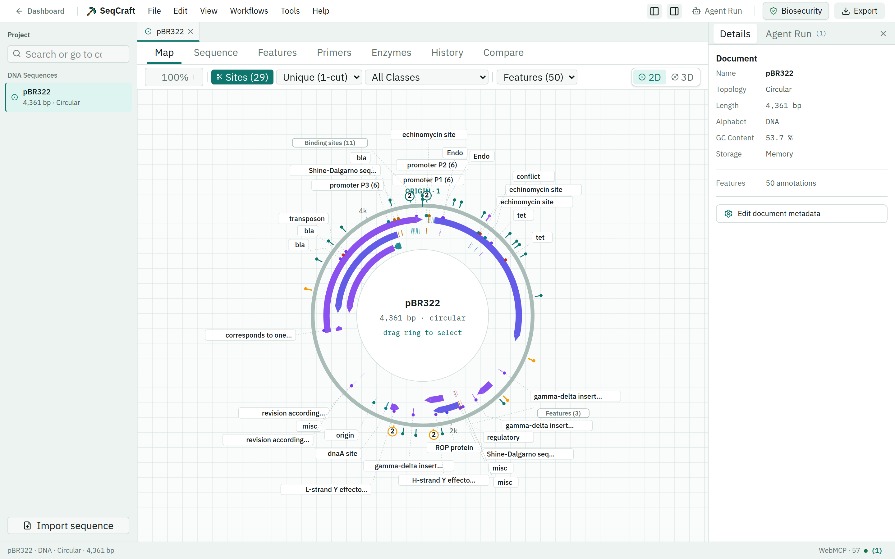
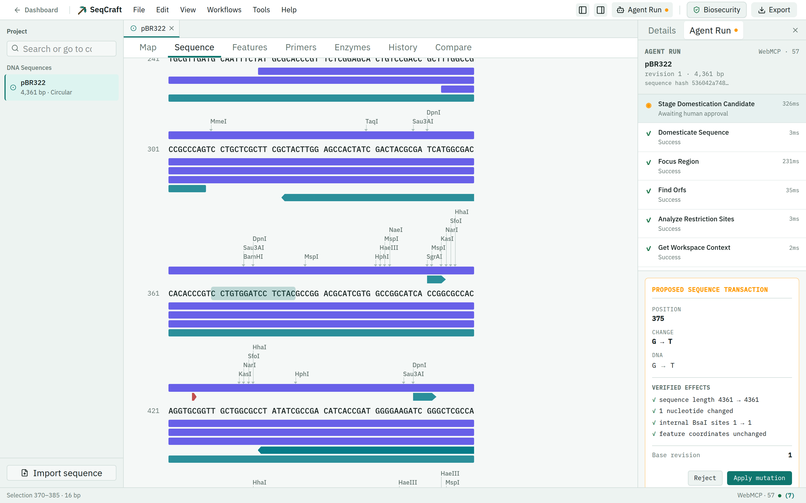

# SeqCraft

SeqCraft is a browser workbench for viewing, editing, and analyzing DNA and RNA. It runs sequence work locally and gives browser agents a safe tool interface through WebMCP.

[Open SeqCraft](https://seqcraft.onrender.com) · [Technical reference](https://seqcraft.onrender.com/#/docs) · [Security policy](SECURITY.md)

## What it does

- Opens FASTA, GenBank, and SeqCraft files.
- Shows linear, circular, and 3D plasmid maps.
- Finds features, primers, restriction sites, and open reading frames.
- Simulates restriction digests, PCR, and Golden Gate assembly.
- Scans CRISPR targets for SpCas9, SaCas9, Cas12a, and Cas12e.
- Compares constructs and keeps undo/redo history.
- Exports FASTA, GenBank, SeqCraft JSON, and Opentrons Python protocols.
- Provides 57 WebMCP tool identifiers for browser agents.



## Privacy and control

Raw sequences, annotations, primers, and derived constructs stay in the browser. The optional server stores account details and sequence-free project metadata only.

Agent-proposed sequence changes are staged for review. SeqCraft shows the proposed change and checks its revision before the user can apply it.



## WebMCP tool reference

SeqCraft exposes 57 tool identifiers through `document.modelContext`. Five are compatibility aliases, so they represent 52 distinct operations. The [live technical reference](https://seqcraft.onrender.com/#/docs) adds descriptions, effects, search, and scientific limits.

<details>
<summary>Show all WebMCP tools</summary>

### Context

Read what is open, selected, supported, or waiting for approval.

```text
seqcraft_get_capabilities
seqcraft_get_workspace_context
seqcraft_get_selected_context
seqcraft_get_document_revision
seqcraft_get_transaction_status
```

### Workspace

Move between documents and views, or change the visible selection.

```text
seqcraft_set_active_document
seqcraft_set_active_view
seqcraft_select_range
seqcraft_select_feature
seqcraft_clear_selection
seqcraft_focus_region
```

### Documents

List, create, copy, rename, or remove documents.

```text
seqcraft_list_documents
seqcraft_get_active_document
seqcraft_create_document
seqcraft_duplicate_document
seqcraft_update_document_metadata
seqcraft_delete_document
```

### Sequence changes

These stage sequence-changing work for human review.

```text
seqcraft_edit_sequence
seqcraft_reverse_complement_region
seqcraft_rotate_origin
seqcraft_copy_region_between_documents
```

`seqcraft_create_document_from_region` creates a new document from a selected region.

### Features

Read, find, show, or change annotations.

```text
seqcraft_list_features
seqcraft_show_feature
seqcraft_mutate_feature
seqcraft_detect_known_features
seqcraft_propose_annotation
```

### Primers and PCR

```text
seqcraft_list_primers
seqcraft_mutate_primer
seqcraft_analyze_primer
seqcraft_simulate_pcr
```

### Restriction and cloning

```text
seqcraft_analyze_restriction_sites
seqcraft_show_restriction_site
seqcraft_simulate_digest
seqcraft_simulate_golden_gate
seqcraft_domesticate_sequence
seqcraft_stage_domestication_candidate
seqcraft_prepare_restriction_clone
```

### Analysis

```text
seqcraft_compare_documents
seqcraft_find_orfs
seqcraft_find_crispr_targets
seqcraft_screen_biosecurity
```

### History

```text
seqcraft_get_history
seqcraft_undo
seqcraft_redo
seqcraft_restore_revision
```

### Import, search, and export

```text
seqcraft_import_sequence_text
seqcraft_search_sequence_database
seqcraft_import_from_database
seqcraft_export_document
```

### Automation

```text
seqcraft_generate_opentrons_protocol
seqcraft_execute_actions
```

### Compatibility aliases

| Alias | Same operation as |
| --- | --- |
| `seqcraft_get_pending_transaction` | `seqcraft_get_transaction_status` |
| `seqcraft_select_sequence_range` | `seqcraft_select_range` |
| `seqcraft_plan_domestication` | `seqcraft_domesticate_sequence` |
| `seqcraft_stage_sequence_transaction` | `seqcraft_stage_domestication_candidate` |
| `seqcraft_export_sequence` | `seqcraft_export_document` |

</details>

## Run locally

Requirements: Node.js 20 or newer and npm 10 or newer.

```bash
git clone https://github.com/sea-deep/seqcraft.git
cd seqcraft
npm install
npm run dev:all
```

Open [http://localhost:5173](http://localhost:5173). SeqCraft works in guest mode without a database or login setup.

## Optional accounts and Google sign-in

Copy `.env.example` to `.env`, then set these server values:

```dotenv
MONGODB_URI=your-mongodb-connection-string
BETTER_AUTH_SECRET=at-least-32-random-characters
BETTER_AUTH_URL=http://localhost:8787
APP_ORIGIN=http://localhost:5173
```

For Google sign-in, also set:

```dotenv
GOOGLE_CLIENT_ID=your-google-client-id
GOOGLE_CLIENT_SECRET=your-google-client-secret
```

Add this authorized redirect URI in Google Cloud:

```text
http://localhost:8787/api/auth/callback/google
```

For a deployed backend, replace `http://localhost:8787` with its public HTTPS URL. The frontend can point to that backend with the `VITE_API_URL` build variable.

## Check changes

```bash
npm test
npm run build
```

The test suite covers sequence math, circular coordinates, file handling, storage, authentication, WebMCP, and user-interface flows.

## Important limits

SeqCraft predicts sequence-level results. It does not replace wet-lab checks for reaction conditions, primer secondary structure, CRISPR off-targets, robot setup, or formal biosecurity review. The [technical reference](https://seqcraft.onrender.com/#/docs) explains each model and its limits.

## Project layout

```text
src/          browser application and scientific code
server/       optional authentication and metadata API
test/         unit and integration tests
docs/assets/  screenshots used by this README
```

## License

[MIT](LICENSE)
